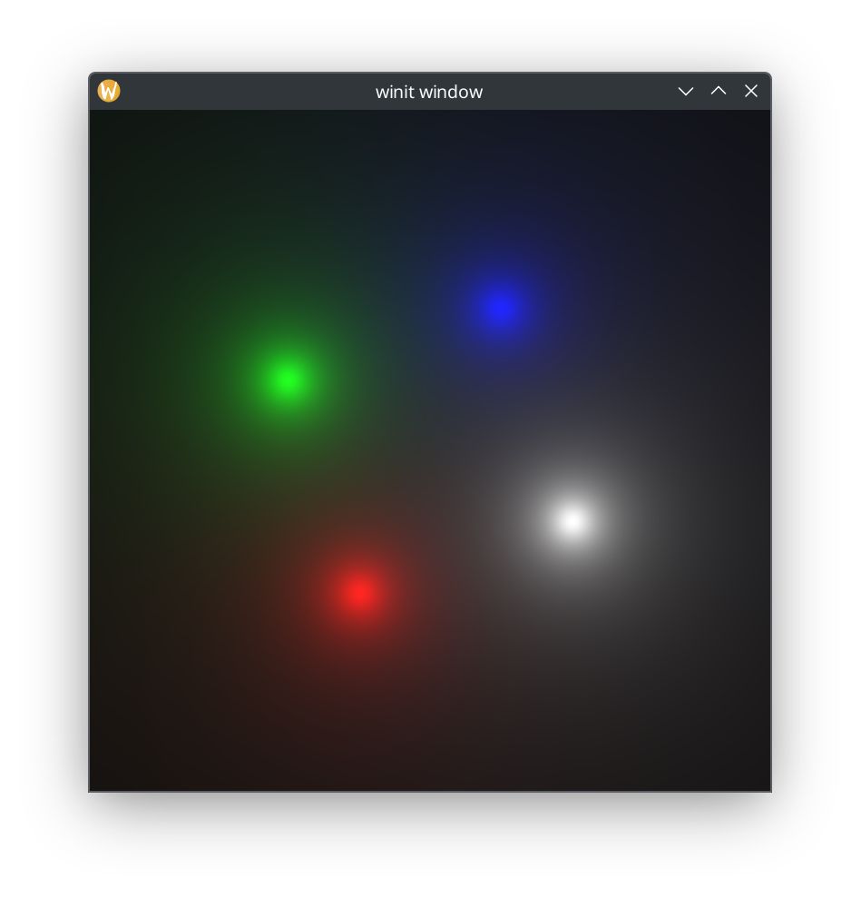

# Glowing Dots Demo


A GPU-accelerated demo showing animated glowing dots using Rust and wgpu.

This builds off of the CPU-based glowing_dots demo program [here](https://github.com/ed-2100/C-CPP-Monorepo).

## Features

- Real-time GPU-accelerated rendering using compute shaders (>10,000 fps on iGPU)
- Smooth animations with proper gamma correction
- Window resizing support with maintained aspect ratio
- FPS counter display
- Cross-platform support via wgpu

## Requirements

- Rust (nightly toolchain)
- A GPU with Vulkan/Metal/DX12/OpenGL support
- Linux/MacOS/Windows

## Running

```sh
cargo run --bin glowing_dots --release
```
